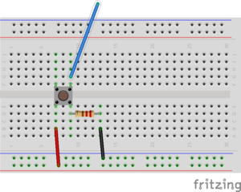

# MIF18 : Scheduling on Arduino -- Prise en main

  * Grégoire Pichon, Université Lyon 1, LIP [email](mailto:gregoire.pichon@univ-lyon1.fr)
  * Version: 2022
  * Original author Laure Gonnord
  * Inspired by a lab with Julien Forget and Thomas Vantroys, Lille
  * Other collaborators: Thierry Excoffier (Lyon1).

## Tinkercad for those following the class remotely

* You have to create an account
* Then go to Circuits section, and Créer un circuit
* You can prepare the circuit, adding an Arduino, a board, several LEDs, a LCD...
* For resistors, you have to properly define the capacity
* Then go to code section, select Texte and you can start coding
* Use Démarrer la simulation to run the code on the Arduino
* There is no main() in the code, you have to fill the setup() function and the loop() function that performs an infinite loop
* Adapt the code for [TinkerCad](http://tinkercad.com): move calls to initialization functions into setup() and the code of while(1) into loop()
* For the scheduler (part 2), a skeleton for tinkercad is given, to avoid including home made librairies

## Problem Description

In the first part of this TP you will be asked to write simple Arduino
programs that interact with sensors/actuators. The objective is
double:
* Manipulate the platform and the compilation chain
* Experiment two variants of Arduino programming and compare their pros and cons.

Prerequisite : Test your arduino setting [follow this
link](_startup_part1.md)

## Step 1:  Led on Digital 13 + Button on Digital 10 (ex1/)

* Button on digital 10, and 220 ohm resistor



*  Write a `int get_button_state()`
  function that reads on digital 10 (use `PINB` value and some boolean
  operators). Use it in the `main` to control the led (switch it on to
  off or off to on if the button is pressed).

## Step 2: Two LEDs with different frequencies (ex2/)

Now make two leds blink at different frequencies (the second one uses
PIN 12). Make your code as generic as possible.

In the report, explain your solution for different values of the
frequencies. Explain why is it satisfactory or not ? What would you
like as a developper?

## Step 3: Led, Button (ex3/) -- only if you have time, i.e., after the second part of the TP

A little journey into the Arduino library. 

### The LED example
* Include `Arduino.h` and link with the lib (the Makefile does this
job):
```C
#include <avr/io.h>
#include <util/delay.h>
#include <Arduino.h>
```

* Now each pin has his own configuration and can be set independently
of the others:   `pinMode(led, OUTPUT);` for the led setup and
`digitalWrite(led, LOW);`,  `digitalWrite(led, HIGH);` to set the led
value.

* We have to store the led state in the `led_on` variable.

* The Arduino C++ library
[reference](https://www.arduino.cc/en/Reference/HomePage). See
the `pinMode` and `digitalRead` documentation.

### Expected Work

* Implement the Button functionality. Test it!

### Feedback Questions

  - Is the readability problem solved?
  - Who is the public targeted by this "language"? It it ok for
    (real-time) system programmers ? 
  - Is this language extensible enough to support new features?
  - What is the price for the developer?
